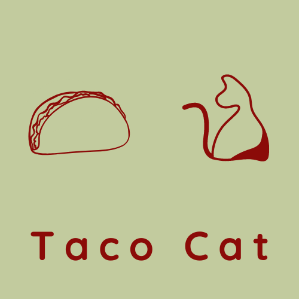

# Taco Cat

Reverse a palindrome. Taco Cat is a JavaScript exercise utilizing arrays and regex. This program
determines if a string is a palindrome. The program accounts for special characters, capitalization, and whitespace,
and will tell you which characters are removed.

## Demo The Project
[nickseyler-tacocat.netlify.app](nickseyler-tacocat.netlify.app)